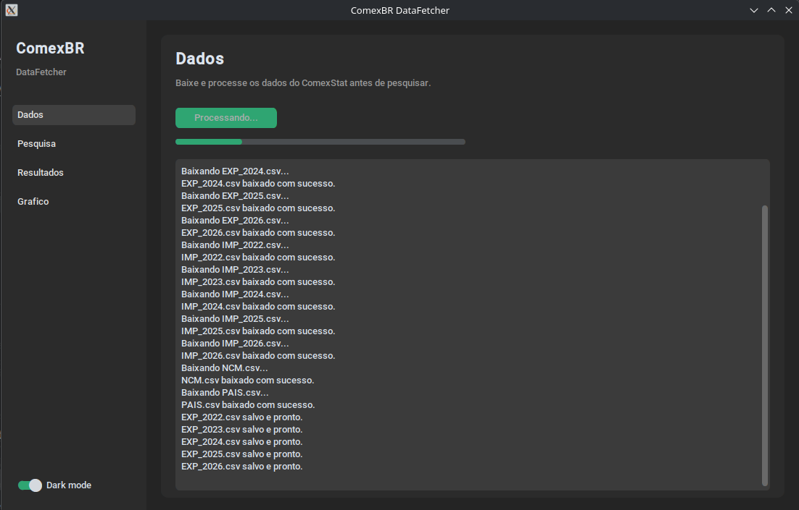
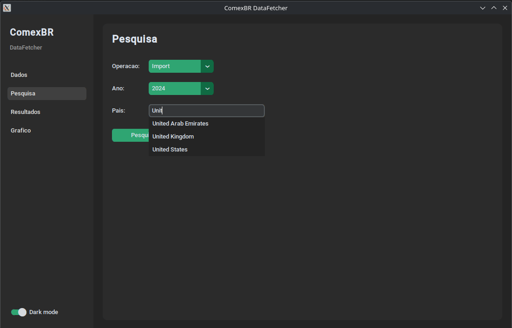
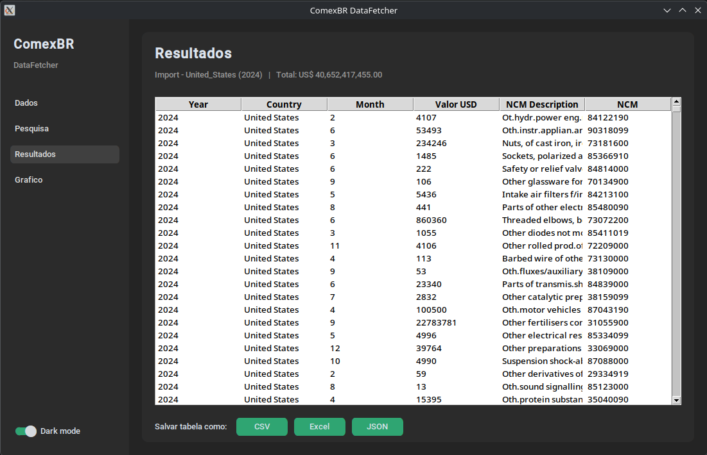
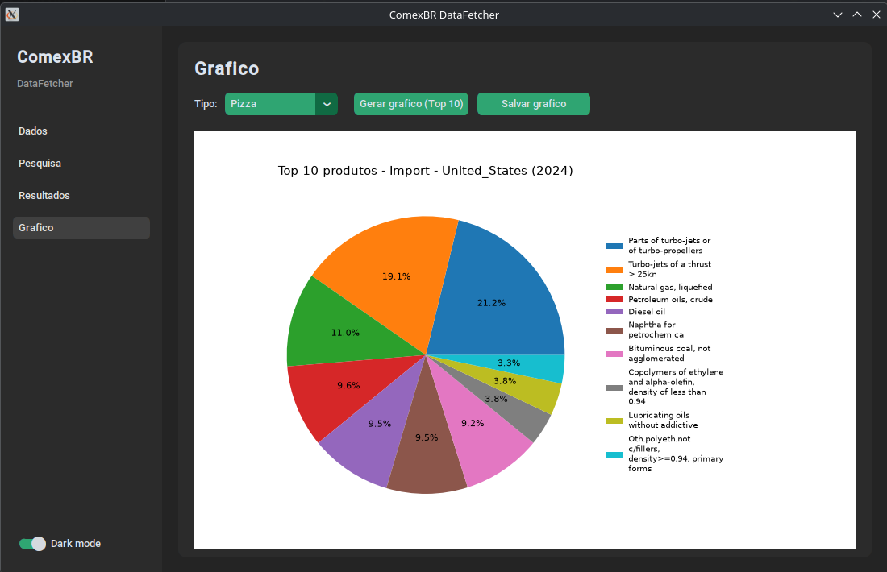

# ComexBR Data Fetcher

A Python application for downloading, processing, analyzing, and exporting Brazilian foreign trade data from the official ComexStat database.

The application allows users to search import and export data by country, generate charts of the top exported/imported products, and export the results in multiple formats.

---

## Features

- Download official ComexStat datasets automatically
- Process raw CSV files into clean datasets
- Search trade data by year, operation and country
- Support for:
  - Export operations
  - Import operations
- Available years:
  - 2022 to 2026
- Generate Top 10 products charts
  - Vertical Bar Chart
  - Horizontal Bar Chart
  - Pie Chart
- Export results as:
  - CSV
  - Excel (.xlsx)
  - JSON
  
  ## Version 2.0 features

  - GUI from customtkinter
  - Added support for data from years 2023, 2024 and 2026
  - Improve user interface and experience
  - Charts bugs corrected
  - Autocomplete on the country search tab
  - Total US$ value in the search results tab

---

## Project Structure

```
ComexStat_DataFetcher/
│
├── data/
│   ├── raw/
│   └── processed/
│
├── results/
│
├── python/
│
├── requirements.txt
├── .gitignore
└── main.py
```

---

## Installation

Clone the repository:

```bash
git clone https://github.com/GabrielFBO/ComexStat_DataFetcher.git
cd ComexBR_DataFetcher
```

Create a virtual environment:

### Linux / macOS

```bash
python -m venv venv
source venv/bin/activate
```

### Fish Shell

```bash
python -m venv venv
source venv/bin/activate.fish
```

Install the required libraries:

```bash
pip install -r requirements.txt
```

---

## Usage

Run the application:

```bash
python main.py
```

The program will guide you through the following steps:

1. Download the required data files from the source (if not already downloaded).
2. Select the operation and year
3. Enter the country name
4. Display the results
5. Optionally export the data to CSV, Excel or JSON
6. Choose the chart style
7. Optionally export the chart as an image file

---

## Data Source

Official ComexStat database provided by the Brazilian Government.

https://comexstat.mdic.gov.br/pt/home

---

## Example






---

## Future Improvements

- Search by NCM code
- Search by product description
- Interactive dashboard
- Language options
- Custom your charts (colors, size, etc.)

---

## License

This project is licensed under the MIT License.

---

## Author

Gabriel B.

GitHub:
https://github.com/GabrielFBO
